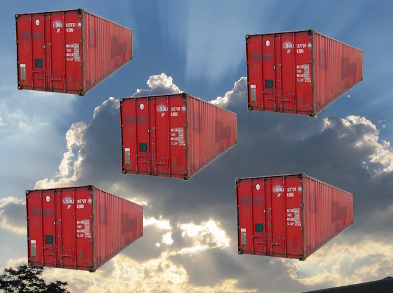
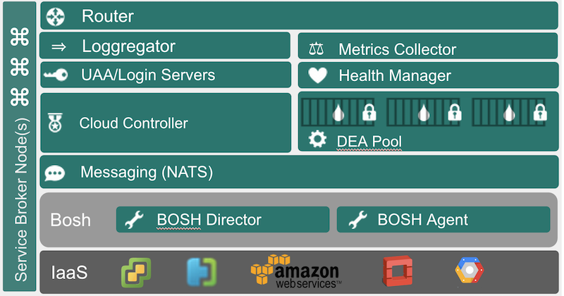

<!-- .slide: class="titlePage" -->

## Docker and Cloud Foundry

#### Shipping containers into the Cloud

Note:
Welcome and Introduction

---

---

## What is Cloud Foundry

Let's take a look

Note:
Show in a demo
- pushing an App
- scaling an App
- log aggregation
- binding service

--

## CF Architecture Overview

Note:
- VMWare, Azure, AWS, OpenStack, Google Compute Engine

--

## Running apps in Cloud Foundry

* App compiled to a Droplet <!-- .element: class="fragment" data-fragment-index="1" -->
* Droplet running isolated inside container <!-- .element: class="fragment" data-fragment-index="2" -->
* Containers provided by Warden <!-- .element: class="fragment" data-fragment-index="3" -->

Note:
- Droplet is read-only and is cached to facilitate quick scaling and recovery
- Droplet generated with Buildpack
- Warden is similar to Docker, uses same Linux Kernel tools (cgroups, namespaces)

--

## Buildpacks

* Creating the environment in which the app runs <!-- .element: class="fragment" data-fragment-index="1" -->
* Highly customizable <!-- .element: class="fragment" data-fragment-index="2" -->
* Write your own <!-- .element: class="fragment" data-fragment-index="3" -->

Note:
- Environment is runtime (like JDK) and Linux Filesystem
- Lot's of example buildpacks out there to use as starting points
- You only need three shell scripts for a buildpack (detect, package, release)

--

## Services

* Third-party collaborators for the app <!-- .element: class="fragment" data-fragment-index="1" -->
* Managed by a service broker <!-- .element: class="fragment" data-fragment-index="2" -->

Note:
- Binding service to app means providing connection details through env variables
- Service Brokers are easy to implement, five simple REST endpoints

--

## Self-hosted or public

* Install it yourself with Bosh
* Use a hosted solution:
  * anynines.de
  * IBM BlueMix
  * Stackato
  * run.pivotal.io

Note:
- One of the main selling points of CF is that you can install it yourself
- Or you can just use any of these services

---

## What is Docker

Let's take a look

Or maybe not <!-- .element: class="fragment" data-fragment-index="1" -->

Note:
Who here knows Docker or has played around with it? Who is using it for production? I prepared
tiny example to show you what Docker is. I have a tiny java app that I want to deploy. It uses Spring Boot and
as you can see, it is the smallest possible Spring Boot app you can have.
For Docker, everything starts with a Dockerfile. In this file you describe the Operating System that will run
your app. In this case, I say, I need an operating system with Java8. Then you write some directive, to do some
things inside this system, like copying files or installing maven. In the very last line, you see the command that
will have to be executed to start the app. So, with this Dockerfile, I will now go ahead and build a Docker image.
To generate the image, all the setup instructions in here will be executed. The image is a read only Linux system
that you get after following all these instructions.
After that you upload this image to a Docker host and there the image will be put into a container and
the last command will be executed. Now, your app is running.
It is interesting to note, that Docker actually was extracted out from another
PaaS, dotCloud.

---

## Docker and Cloud Foundry

* Docker Buildpack
* Docker ServiceProvider
* Cloud Rocker
* Diego
* Lattice

Note:
- These are five projects that bring CF and Docker together

---

## Docker Buildpack

* Using all the benefits of the CF platform for Docker containers
* Requires external docker host
* https://github.com/duglin/cf-docker

Note:
- Created by Doug Davis from IBM
- Pushing Docker containers through CF command line
- Docker containers are running outside of Cloud Foundry

---

## Docker Service

* Service Provider to expose Docker containers as services
* Requires external Docker host (can be installed through Bosh)
* https://github.com/cf-platform-eng/cf-containers-broker

Note:
- Created by Ferdi from Pivotal
- Enables easy service binding for services running inside Docker containers
- Broker and Services are running outside of Cloud Foundry on a Docker Host

---

## Cloud Rocker

* Build Docker images using CF buildpacks
* Rapid turnaround for local development
* https://github.com/CloudCredo/cloudrocker

Note:
- CloudCredo is doing cool stuff with Cloud Foundry, this is just one example
- Also use this for buildpack development

---

## Diego

* Rewrite of CF DEA
* Provides built-in support for Docker containers
* http://youtu.be/e76a50ZgzxM

Note:
- Diego is transforming Cloud Foundry as a whole
- Interesting talk from Onsi about Why and How Diego
- DockPush - a CLI plugin to push Docker containers into Diego

---

## Lattice

* Standalone scheduler extracted from Diego for Docker images
* Compare to Kubernetes, Marathon/Mesos
* https://github.com/pivotal-cf-experimental/lattice

Note:
- Very young project
- Think of it as a Cloud Foundry lite

---

## Containers vs Buildpacks

*Containers* are better when:

* Developers require more control
* Developers know Ops/Docker
* Time to Market is important

---

## Containers vs Buildpacks

*Buildpacks* are better when:

* Ops requires more control
* Developers focus on application
* Low maintenance cost is important

Note:
- I am biased towards Buildpacks, but there are good reasons to push containers

---

## Outlook: Rocket

* New Container engine by CoreOS
* Focused on security
* Creating Container Spec
* Supported by Google, Pivotal...

Note:
- Rocket is important for the Container ecosystem - competition is good
